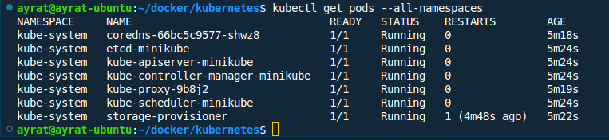
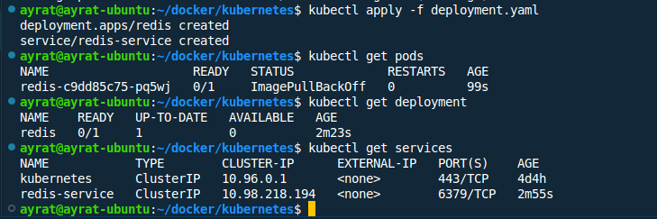

# Домашнее задание к занятию «Kubernetes. Часть 1»

Это задание для самостоятельной отработки навыков и не предполагает обратной связи от преподавателя. Его выполнение не влияет на завершение модуля. Но мы рекомендуем его выполнить, чтобы закрепить полученные знания.
---
### Задание 1

**Выполните действия:**

1. Запустите Kubernetes локально, используя k3s или minikube на свой выбор.
1. Добейтесь стабильной работы всех системных контейнеров.

**Решение №1**
```
curl -LO https://github.com/kubernetes/minikube/releases/latest/download/minikube-linux-amd64
sudo install minikube-linux-amd64 /usr/local/bin/minikube && rm minikube-linux-amd64
minikube start
kubectl get pods --all-namespaces
```




---
### Задание 2

Есть файл с деплоем:

```
apiVersion: apps/v1
kind: Deployment
metadata:
  name: redis
spec:
  selector:
    matchLabels:
      app: redis
  replicas: 1
  template:
    metadata:
      labels:
        app: redis
    spec:
      containers:
      - name: master
        image: bitnami/redis
        env:
         - name: REDIS_PASSWORD
           value: password123
        ports:
        - containerPort: 6379
```


**Выполните действия:**

1. Измените файл с учётом условий:

 * redis должен запускаться без пароля;
 * создайте Service, который будет направлять трафик на этот Deployment;
 * версия образа redis должна быть зафиксирована на 6.0.13.

2. Запустите Deployment в своём кластере и добейтесь его стабильной работы.

**Решение №2**
```
apiVersion: apps/v1
kind: Deployment
metadata:
  name: redis
spec:
  selector:
    matchLabels:
      app: redis
  replicas: 1
  template:
    metadata:
      labels:
        app: redis
    spec:
      containers:
      - name: master
        image: bitnami/redis:6.0.13
        env:
         - name: ALLOW_EMPTY_PASSWORD
           value: "yes"
        ports:
         - containerPort: 6379
---
apiVersion: v1
kind: Service
metadata:
  name: redis-service
spec:
  selector:
    app: redis
  ports:
    - protocol: TCP
      port: 6379
      targetPort: 6379
  type: ClusterIP      
```


---
### Задание 3

**Выполните действия:**

1. Напишите команды kubectl для контейнера из предыдущего задания:

 - выполнения команды ps aux внутри контейнера;
 - просмотра логов контейнера за последние 5 минут;
 - удаления контейнера;
 - проброса порта локальной машины в контейнер для отладки.

**Решение №3**
Команды kubectl:
 - выполнения команды ps aux внутри контейнера:
```
kubectl exec redis-c9dd85c75-pq5wj -- ps aux
```
 - просмотра логов контейнера за последние 5 минут:
```
kubectl logs --since=5m redis-c9dd85c75-pq5wj
```
 - удаления контейнера:
```
kubectl delete pod -l app=redis
```
 - проброса порта локальной машины в контейнер для отладки:
```
kubectl port-forward deployment/redis 6379:6379
```

### Задание 4

Есть конфигурация nginx:

```
location / {
    add_header Content-Type text/plain;
    return 200 'Hello from k8s';
}
```

**Выполните действия:**

Напишите yaml-файлы для развёртки nginx, в которых будут присутствовать:

 - ConfigMap с конфигом nginx;
 - Deployment, который бы подключал этот configmap;
 - Ingress, который будет направлять запросы по префиксу /test на наш сервис.

**Решение №4**
configmap.yaml:
```
apiVersion: v1
kind: ConfigMap
metadata:
  name: nginx-config
data:
  nginx.conf: |
    location / {
        add_header Content-Type text/plain;
        return 200 'Hello';
    }
```
deployment.yaml:
```
apiVersion: apps/v1
kind: Deployment
metadata:
  name: nginx-deployment
spec:
  replicas: 1
  selector:
    matchLabels:
      app: nginx
  template:
    metadata:
      labels:
        app: nginx
    spec:
      containers:
      - name: nginx
        image: nginx:latest
        ports:
        - containerPort: 80
        volumeMounts:
        - name: nginx-config-volume
          mountPath: /etc/nginx/conf.d
      volumes:
      - name: nginx-config-volume
        configMap:
          name: nginx-config
```
ingress.yaml:
```
apiVersion: networking.k8s.io/v1
kind: Ingress
metadata:
  name: nginx-ingress
spec:
  rules:
  - http:
      paths:
      - path: /test
        pathType: Prefix
        backend:
          service:
            name: nginx-service
            port:
              number: 80
---
apiVersion: v1
kind: Service
metadata:
  name: nginx-service
spec:
  selector:
    app: nginx
  ports:
    - protocol: TCP
      port: 80
      targetPort: 80
```
Применение YAML-файлов:
```
kubectl apply -f configmap.yaml
kubectl apply -f deployment.yaml
kubectl apply -f ingress.yaml
```
Теперь можно получить доступ к Nginx через Ingress. Для Minikube нужно узнать IP адрес ingress контроллера:
```
minikube ip
```
Затем открыть в браузере [minikube_ip]/test. Должно отобразиться "Hello".